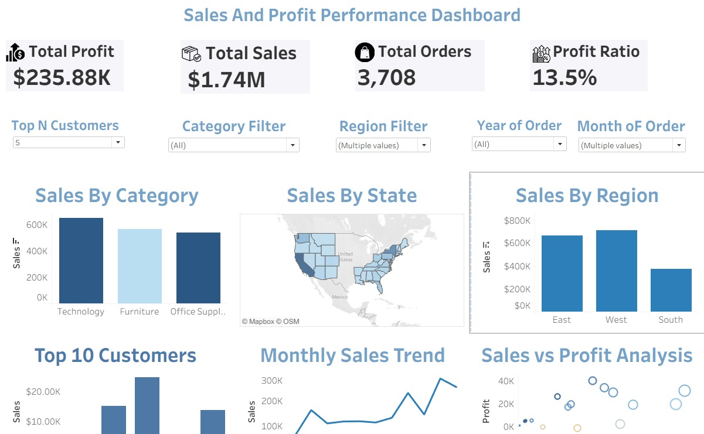

# 📊 Sales & Profit Performance Dashboard (Tableau)

## 🔍 Overview

This project showcases an interactive **Sales & Profit Performance Dashboard** built using Tableau. The dashboard provides a comprehensive view of business performance, including sales trends, profitability, customer insights, and regional analysis.

---

## 🎯 Objectives

* Analyze overall sales and profit performance
* Identify high-performing regions and categories
* Understand customer purchasing behavior
* Enable interactive data exploration using filters and parameters

---

## 📈 Key Features

### 🔹 KPI Metrics

* **Total Sales**
* **Total Profit**
* **Total Orders**
* **Profit Ratio**
* **Average Order Value**

---

### 🔹 Visualizations

* 📅 **Monthly Sales Trend** – Tracks sales over time
* 🗺️ **Sales by State** – Geographic performance analysis
* 📊 **Sales by Category** – Category-wise sales comparison
* 👥 **Top Customers** – Dynamic Top N customer analysis
* 🔵 **Sales vs Profit** – Scatter plot for performance insights

---

## ⚙️ Interactive Elements

* Filters: **Region, Category, Segment**
* Parameter: **Dynamic Top N (5 / 10 / 20 customers)**
* Click-based filtering across charts

---

## 💡 Key Insights

* Technology category contributes the highest profit
* Certain regions show high sales but lower profitability
* A small group of customers generates a large portion of revenue
* Sales follow noticeable monthly trends

---

## 🛠️ Tools & Technologies

* **Tableau Public**
* **Superstore Dataset**

---

## 📷 Dashboard Preview

---

## 🚀 How to Use

1. Download the `.twbx` file
2. Open in Tableau Desktop / Tableau Public
3. Use filters and parameter controls to explore insights

---

## 📢 Conclusion

This dashboard demonstrates how interactive visualizations can help analyze business performance and support data-driven decision-making.

---
